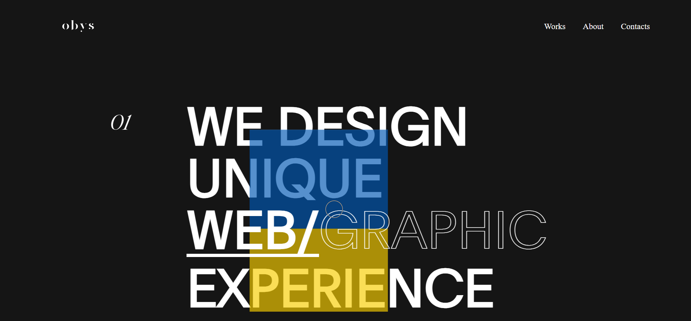
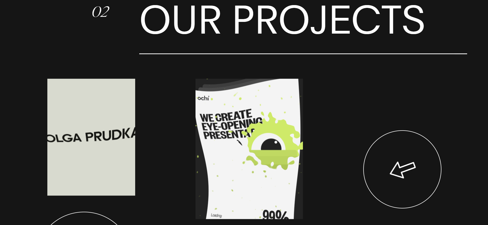

🌐 Obys Agency Clone

A modern and responsive clone of the Obys Agency website built using HTML, CSS, and JavaScript.  
This project is for learning and practice purposes, inspired by the original [Obys Agency](https://obys.agency).

🔗 Live Demo: 👉 [View Website](https://notanormaldev.github.io/OBYS-AGENCY/)

---

📸 Screenshots

🏠 Landing Page

 📂 Project Page

---

🚀 Features
- 📱 Fully Responsive Design  
- 🎞️ Smooth CSS & JavaScript Animations  
- 🎨 Modern UI inspired by Obys Agency  
- 🧑‍💻 Simple and clean code structure  

---

🛠️ Tech Stack
- HTML – Markup  
- CSS – Styling & Layout  
- JavaScript – Animations & Interactions  

---

👨‍💻 About Me

Hi, I'm Harsh 👋 — a passionate Front-End Developer who loves building modern, responsive, and animated web experiences.  
I work with HTML, CSS, JavaScript, React.js, Redux, GSAP, and Locomotive Scroll to create smooth, interactive websites.  

- 🌐 Project: [Obys Agency Clone](https://notanormaldev.github.io/OBYS-AGENCY/)  
- 💻 Other Projects: Coming soon...  
- 📫 Reach me at: harshpatel20050@gmail.com  
- 🔗 Connect on [LinkedIn](https://www.linkedin.com/in/harsh-patel-a77148314?utm_source=share&utm_campaign=share_via&utm_content=profile&utm_medium=android_app)  
